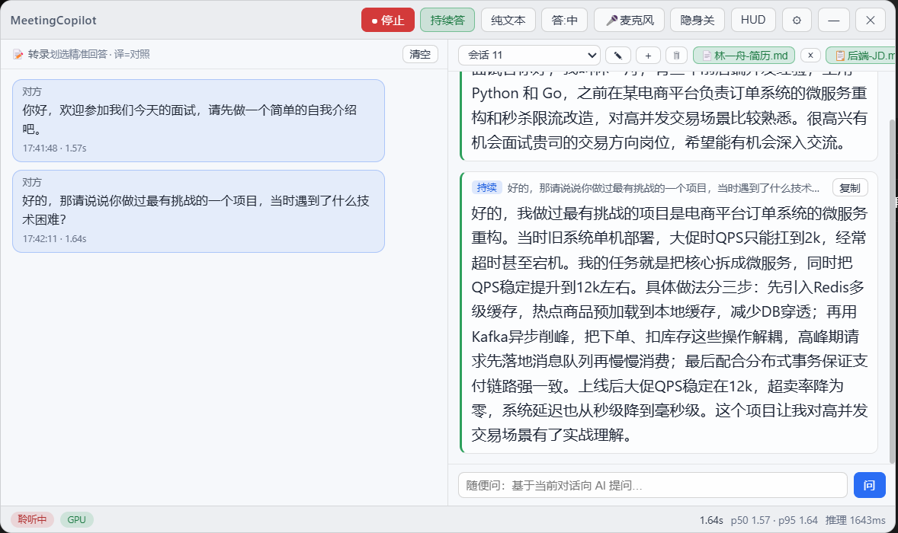
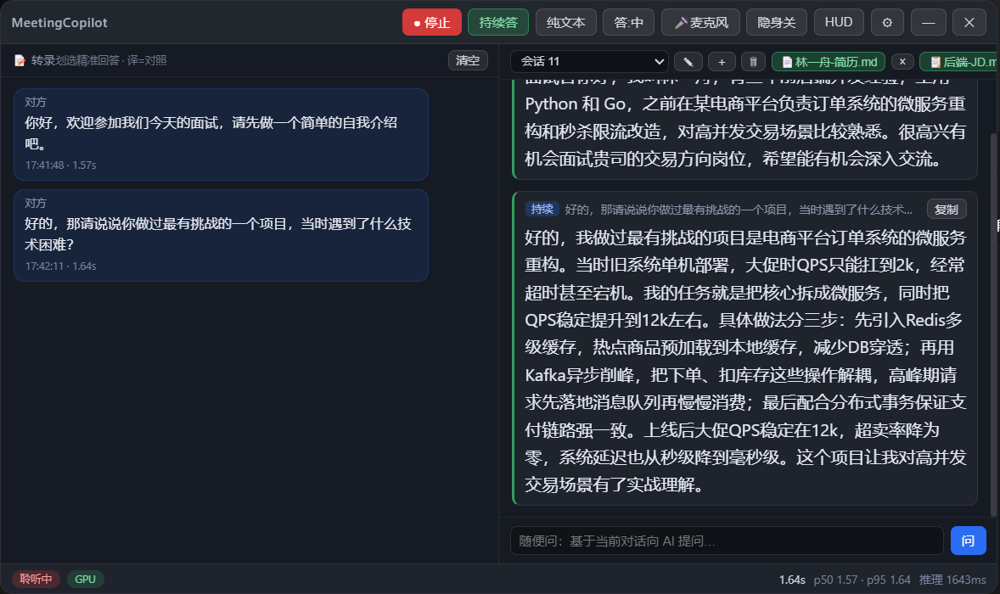
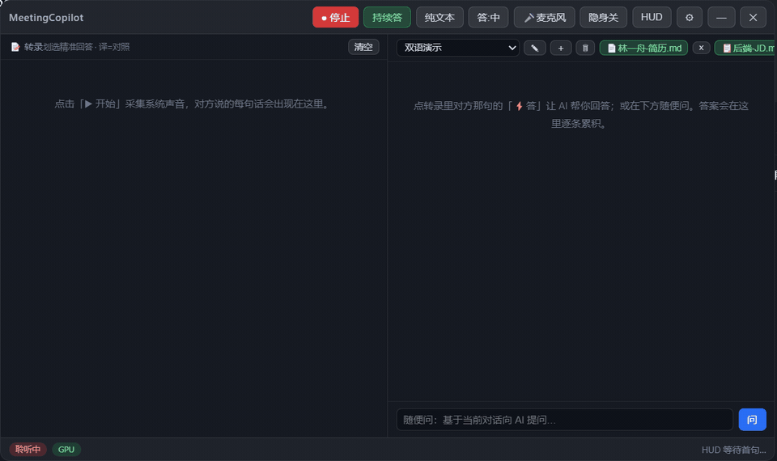

# MeetingAssistant 会议助手

[](https://github.com/lakaka2970/MeetingAssistant-main/actions/workflows/ci.yml)
[](LICENSE)

> 实时会议 / 面试助手：一边流式转写对方的话，一边用 AI 生成你可以**照着念**的第一人称回答。
> Windows / macOS · 本地优先 · BYOK（自带 Key，没有账号系统、没有中间服务器）

Real-time meeting/interview assistant for Windows and macOS: streaming ASR captions of the other
party plus first-person AI answers you can read aloud. Local-first, bring-your-own-key, no bot joins
your meeting — it just listens to your system audio. 中文文档为主，English summary at the bottom.

---

## ✨ 核心功能

- **实时流式转写**：通过系统回环音频采集对方声音，**不碰会议软件**——Teams、Zoom、飞书、腾讯会议、任意视频都能用，不需要机器人入会、不需要抓包。
- **第一人称 AI 回答**：在对方任意一句上点 **⚡答**，右栏流式生成可直接照着念的回答；打开 **持续答** 后，只有像问题的句子才会自动触发。
- **回答可控**：`答:中 / 答:EN` 切换回答语言；`纯文本 / 多模态` 在文本大模型与视觉模型（可**截图提问**）之间切换。
- **公式与排版正常显示**：回答里的 `$…$` / `$$…$$` / `\(…\)` / `\[…\]` 由 KaTeX 排版（含 `$ … $` 这种两端带空格的写法），`**加粗**`、`*斜体*`、`` `代码` ``、`### 小标题` 也直接渲染，不再把 markdown 原样吐在屏幕上。
- **贴合你的阅历**：右栏 **📄简历 / 📋JD** 导入资料（`.md/.txt/.docx/.pdf`），本地解析、本地建立索引，只在提问时作为上下文发给大模型——资料本身不离开你的电脑。不同面试是不同的会话，各自绑定自己的资料与答案库。
- **提前准备的答案优先亮出来**：资料或笔记里写成 `问：… 答：…` / `Q: … A: …` / `【问题】…【回答】…` 的段落会被自动识别成问答对并按「问题」建索引。面试官的问题命中时，右栏**先原样显示你准备的答案**（本地检索，几十毫秒内可见），再由 AI 在其基础上充实成可以直接念的完整回答——这条路径完全离线。
- **知识库没有答案才联网**：只有本地知识库毫无命中时，才会把问题发给你自己配置的搜索引擎（Tavily / Brave / SerpAPI，BYOK，默认关闭），检索结果作为回答依据并附上来源；一次检索最多等 2.5 秒，超时即放弃、绝不影响出词。
- **会话可删除**：右栏 🗑 删除整场对话（对话、转录、已索引的简历/JD 与其准备答案一并清除，有二次确认）。
- **本地优先**：默认语音识别是本地 FunASR，音频**不出本机**；云端方案（阿里云百炼等）只在你自己配置后才会发送音频。
- **隐身模式**：`隐身开/关` 让窗口对录屏 / 屏幕共享 / 截图不可见（Windows 有效，macOS 尽力而为），窗口默认也不出现在任务栏——隐藏后用快捷键（默认 `Control+B`）或系统托盘找回。
- **BYOK 隐私边界**：API Key 用系统加密存储在本机；没有账号、没有服务器、不代收任何费用，费用直接付给服务商。
- **为普通用户设计**：首次启动 5 步配置向导（含方案卡片、图文 Key 教程、声音检测、**真实连接测试**，14 个统一错误代码）；状态栏芯片一眼看清转写 / AI / 声音是否可用；诊断报告不含 Key、转写与简历内容，可直接贴进 issue。
- **中英双语界面**：向导里选择语言，应用启动即用该语言；系统托盘提供「开始 / 停止转写 / 新建会话 / 设置 / 服务状态 / 帮助与教程 / 检查更新 / 退出」。

## 📸 界面预览

| 浅色 | 深色 |
|---|---|
|  |  |

- 双语实时演示：
- 完整演示视频：[MeetingAssistant-demo.mp4](docs/MeetingAssistant-demo.mp4)

## 🔌 支持的 AI 服务（BYOK）

| 能力 | 服务 |
|---|---|
| 流式语音识别（云端） | 阿里云百炼实时识别（推荐）· MiMo（Beta） |
| 分段语音识别 | MiMo · 自定义 OpenAI 兼容服务 |
| 本地语音识别 | FunASR（默认）· MOSS-Transcribe-Diarize（实验）· Whisper（离线兜底） |
| 文本大模型 | DeepSeek（推荐）· 智谱 · Groq · Gemini · Ollama（本地）· 自定义 OpenAI 兼容 |
| 多模态大模型 | Gemini（默认经本地代理）· 自定义视觉模型 |

语音识别与 AI 回答通常各需要一个 Key，同一服务商可复用；
「极简配置」方案只需注册一个平台（MiMo，语音识别与回答共用 1 个 Key）。Key 领取教程见 [API_KEYS.zh-CN.md](docs/user/API_KEYS.zh-CN.md)。

## ⚡ 快速开始（普通用户）

全程不需要安装 Node.js / Python，也不需要敲命令（本地转写才需要自备 Python，见下文）。

1. 从 [Releases 页面](https://github.com/lakaka2970/MeetingAssistant-main/releases/latest) 下载
   `MeetingAssistant-<版本>-win-x64.exe`（安装版）或 `...-portable.exe`（免安装版）；
   建议核对旁边的 `.exe.sha256` 校验文件。
2. 启动后跟着 **5 步配置向导**走：欢迎 → 选择方案 → 配置服务（粘贴 Key 并「保存并测试连接」）→ 连接测试（检测电脑声音）→ 完成。
3. 播放会议 / 视频，点标题栏 **▶ 开始**，左栏「转录」开始出字。
4. 在对方那句上点 **⚡答** 生成回答；打开 **持续答** 自动接话；在右栏导入 **📄简历 / 📋JD** 让回答贴合你的经历。

> Windows SmartScreen 会提示「已保护你的电脑」——当前为未签名 Beta，确认来源后点「更多信息 → 仍要运行」即可。

详细走查：[QUICK_START.zh-CN.md](docs/user/QUICK_START.zh-CN.md) · 安装说明：[INSTALL_WINDOWS.zh-CN.md](docs/user/INSTALL_WINDOWS.zh-CN.md) · 故障排查：[TROUBLESHOOTING.zh-CN.md](docs/user/TROUBLESHOOTING.zh-CN.md)

macOS 暂无安装包，需从源码运行（系统声音需 BlackHole 虚拟音频设备）：[INSTALL_MACOS.en.md](docs/user/INSTALL_MACOS.en.md)

## 💻 本地语音识别（可选，免云端）

应用**自动拉起并回收**本地 sidecar 进程，你只需在设置里选好方案，模型首次运行自动下载。

### FunASR（默认本地方案）

Python 3.10 conda 环境 + `funasr` + `torch`（NVIDIA GPU 推荐）：

```bash
conda create -n funasr python=3.10 -y
conda activate funasr
pip install "torch==2.11.0" --index-url https://download.pytorch.org/whl/cu128   # 按你的 GPU 选择
pip install -r requirements-funasr.txt
```

模型（paraformer ≈880MB / Nano ≈1.7GB）首次运行自动从 ModelScope 下载。解释器查找顺序：
`MC_FUNASR_PYTHON` → 项目 `.venv` → `C:\ProgramData\miniconda3\envs\funasr` → `python`（PATH）。

### MOSS-Transcribe-Diarize 0.9B（实验）

隔离的 Python 3.12 环境，避免 Transformers 5.x 干扰 FunASR：

```powershell
conda create -n moss-asr python=3.12 -y
conda run -n moss-asr python -m pip install torch==2.11.0 --index-url https://download.pytorch.org/whl/cu128
conda run -n moss-asr python -m pip install -r requirements-moss.txt
```

首次运行从 Hugging Face 下载约 1.7GB BF16 权重，设备顺序 CUDA BF16 → CPU。可用 `MC_MOSS_PYTHON` / `MC_MOSS_DEVICE` 覆盖解释器与设备。注意 MOSS 非流式模型，按约 700ms 静音分段整句返回。

### Whisper turbo（离线兜底）

把 [`onnx-community/whisper-large-v3-turbo-ONNX`](https://huggingface.co/onnx-community/whisper-large-v3-turbo-ONNX)
放入 `%APPDATA%/MeetingAssistant/models/onnx-community/whisper-large-v3-turbo-ONNX/`，编码器走 DirectML GPU。

完整平台配置见 [docs/windows/SETUP.zh-CN.md](docs/windows/SETUP.zh-CN.md)（Windows）与 [docs/macos/SETUP.md](docs/macos/SETUP.md)（macOS）。

## 🛠 从源码开发

### 环境要求

| 组件 | 要求 |
|---|---|
| 系统 | Windows 10 / 11（64 位）；macOS 14+（Apple silicon） |
| 运行时 | Node.js ≥ 20 与 npm |
| LLM Key | 任意 OpenAI 兼容 API Key（推荐 DeepSeek） |

### 安装与运行

```bash
git clone https://github.com/lakaka2970/MeetingAssistant-main.git
cd MeetingAssistant-main
npm install        # postinstall 会应用 patches/（transformers.js 补丁，勿删）
npm run build
start.bat          # Windows 一键启动（自动构建），或 npm start
```

> 🇨🇳 npm / Electron 下载慢时，在项目根目录建 `.npmrc`：
> `registry=https://registry.npmmirror.com` 与 `electron_mirror=https://npmmirror.com/mirrors/electron/`

### 常用脚本

| 命令 | 作用 |
|---|---|
| `npm run dev` | 开发模式（electron-vite dev，热更新） |
| `npm run build` / `npm start` | 构建 / 预览构建产物 |
| `npm run typecheck` | TypeScript 全量类型检查 |
| `npm test` / `npm run test:python` | 单元测试 / Python sidecar 测试 |
| `npm run verify` | 类型检查 + 测试 + 构建（提交前推荐） |
| `npm run dist:win` | 打包 Windows 安装包（NSIS + portable） |
| `npm run smoke:*` | 各能力冒烟测试（ASR / LLM / RAG / E2E） |

### 可选：原生音频后端（Rust）

默认 `audio.captureBackend = webaudio`，开箱即用。想要 Windows WASAPI 回环直采（无需虚拟声卡）
可构建 `rust/` 下的 napi-rs 模块（`cd rust && npm install && npm run build:release`），产物
`resources/native/meeting-assistant-audio.node` 缺失时自动回退 Web Audio 路径。详见 [rust/README.md](rust/README.md)。

## 📁 项目结构

```
electron/     # 主进程：悬浮窗、隐身、快捷键、设置、IPC、ASR/LLM/RAG 宿主、托盘
src/          # 渲染进程（React）：转录面板、回答会话、知识库、设置、配置向导
shared/       # 纯数据模块（渲染/主进程共用）：服务商目录、协议、平台差异
electron/asr/ # 语音识别后端路由（FunASR sidecar / MOSS / 云端 / Whisper）
electron/llm/ # LLM 适配与路由（流式、多模态、失败回退）
electron/rag/ # 简历/JD 索引与检索（本地解析，提问时注入上下文）
tools/        # Python sidecar 服务器与冒烟脚本（funasr_stream_server.py 等）
rust/         # 可选原生音频采集（napi-rs + WASAPI/cpal）
docs/         # 用户文档（快速开始 / API Key / 故障排查 / 平台配置）与截图素材
```

## ✅ 测试与质量

CI（`.github/workflows/ci.yml`）在 Windows 上自动执行：`typecheck` → `npm test` → `test:python`
→ `build` → `verify:patched`（确认 transformers.js 补丁未被依赖安装覆盖）。
本地提交前可跑 `npm run verify`。诊断问题：应用内 **设置 → 高级设置 → 诊断信息** 生成不
含敏感内容的诊断报告，可随 issue 提交。

## 📚 文档索引

| 文档 | 说明 |
|---|---|
| [QUICK_START.zh-CN.md](docs/user/QUICK_START.zh-CN.md) / [EN](docs/user/QUICK_START.en.md) | 面向普通用户的五步快速开始 |
| [API_KEYS.zh-CN.md](docs/user/API_KEYS.zh-CN.md) / [EN](docs/user/API_KEYS.en.md) | 各服务商 Key 领取教程 |
| [TROUBLESHOOTING.zh-CN.md](docs/user/TROUBLESHOOTING.zh-CN.md) / [EN](docs/user/TROUBLESHOOTING.en.md) | 错误代码表与排查指南 |
| [INSTALL_WINDOWS.zh-CN.md](docs/user/INSTALL_WINDOWS.zh-CN.md) / [EN](docs/user/INSTALL_WINDOWS.en.md) | Windows 安装说明（含 SHA256 校验） |
| [INSTALL_MACOS.en.md](docs/user/INSTALL_MACOS.en.md) | macOS 从源码安装与 BlackHole 音频路由 |
| [docs/windows/SETUP.md](docs/windows/SETUP.md) / [zh-CN](docs/windows/SETUP.zh-CN.md) | Windows 平台完整配置（Python / 本地 ASR） |
| [docs/macos/SETUP.md](docs/macos/SETUP.md) | macOS 平台完整配置 |
| [RELEASE_NOTES_v0.2.0-beta.1.md](docs/user/RELEASE_NOTES_v0.2.0-beta.1.md) | 版本说明与已知问题 |

## 📄 开源许可

[Apache License 2.0](LICENSE)

---

## English

**MeetingAssistant** is a real-time meeting / interview assistant for Windows and macOS. It captures
the other party through **system loopback audio** (no bot, no integration—works with any meeting app),
transcribes it with streaming ASR, and generates **first-person answers you can read aloud**, powered
by your own BYOK (bring-your-own-key) LLM provider. It is local-first: the default ASR backend
(FunASR) runs on your machine and audio never leaves it unless you configure a cloud provider.

**Highlights**

- Streaming ASR: local FunASR (default), Alibaba Cloud Bailian realtime (recommended cloud), MiMo, experimental MOSS-Transcribe-Diarize, offline Whisper fallback
- Per-line ⚡Ans answers + 🎤 optional mic channel; text (`纯文本`) or multimodal/vision mode with screenshot Q&A
- Knowledge panel: import your resume/JD (`.md/.txt/.docx/.pdf`), parsed and indexed locally, only sent to your LLM as context when asking; each session is one interview with its own material
- Prepared answers surface first: `问：… 答：…` / `Q: … A: …` / `【问题】…【回答】…` blocks in your documents or notes are auto-detected and indexed by question; on a hit the pane prints your prepared answer verbatim (local, tens of ms) and the AI only enriches it — no network on that path
- Web search is the fallback, not the default: only a question the knowledge base cannot answer at all reaches your own search key (Tavily / Brave / SerpAPI, off by default), under a hard 2.5 s deadline, and the answer cites what came back
- Journal maths render properly: `$…$`, `$$…$$`, `\(…\)`, `\[…\]` are typeset with KaTeX (space-padded `$ … $` included), and `**bold**`, `*italic*`, `` `code` `` and `### headings` are rendered instead of shown raw
- Sessions are deletable: 🗑 drops the conversation, its transcript and everything its resume/JD contributed to the index, after a confirmation
- BYOK: keys encrypted on-device; no account system, no servers, no reseller fees
- Stealth mode hides the window from screen share/screenshots (effective on Windows); global hotkey `Ctrl+B` + system tray to bring it back
- 5-step first-run wizard, real connection tests (14 normalized error codes), status chips, local diagnostics, in-app help — bilingual UI (中文 / English)

**Install (Windows)**: download the NSIS installer or portable `.exe` from the
[Releases page](https://github.com/lakaka2970/MeetingAssistant-main/releases/latest) and verify the
SHA256 sidecar file. macOS: run from source (needs a virtual audio device such as BlackHole) — see
[INSTALL_MACOS.en.md](docs/user/INSTALL_MACOS.en.md).

**Run from source**: `git clone … && npm install && npm run build && npm start` (Node ≥ 20). Full
walkthrough: [QUICK_START.en.md](docs/user/QUICK_START.en.md). Key guides:
[API_KEYS.en.md](docs/user/API_KEYS.en.md). Troubleshooting:
[TROUBLESHOOTING.en.md](docs/user/TROUBLESHOOTING.en.md).

**Supported providers**: DeepSeek, Alibaba Cloud DashScope (CN/INTL), MiMo, Zhipu, Groq, Gemini,
Ollama, plus any OpenAI-compatible endpoint — see `shared/providerCatalog.ts` (single source of truth).

**License**: [Apache-2.0](LICENSE). This is an unsigned beta (`v0.2.0-beta.1`) — download only from
this project's Releases page.